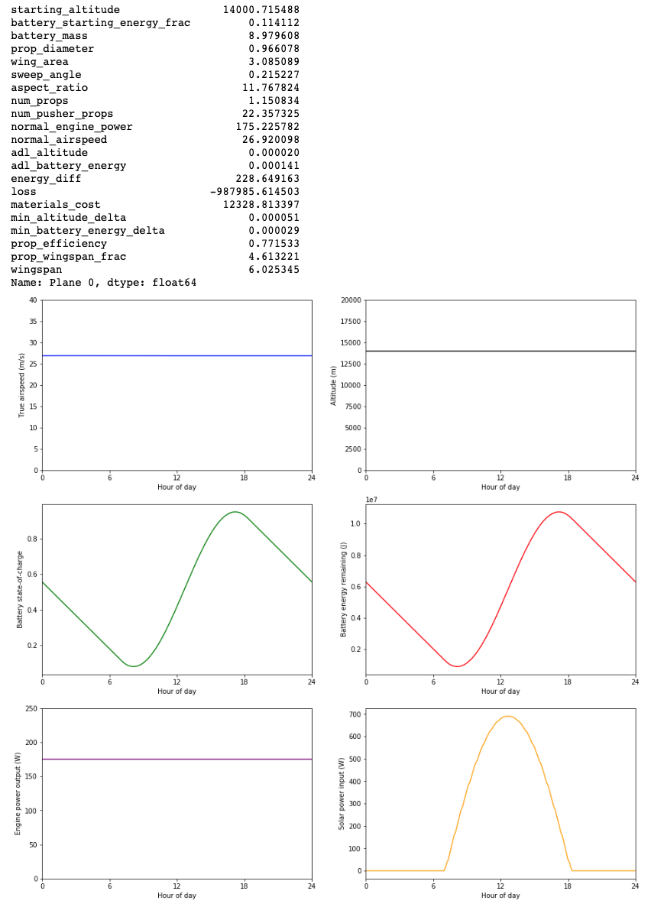

# atmosat
Atmospheric electric satellite. See <b>atmosat.ipynb</b>.

The goal of this notebook is to determine if a solar plane can sustain flight, and if it can, figure out what the cheapest solar plane that can sustain flight is.

The approach is to first make a model of a solar plane that can be fed different parameters about the plane (wingspan, battery mass, cruising altitude, number of props, payload mass, etc). With this model, we can then feed in different plane configutations and figure out which configuration leads to the optimal results.

### Results - see notebook for details. All units are in metric (meters, kg, kW, etc.) and US dollars.

