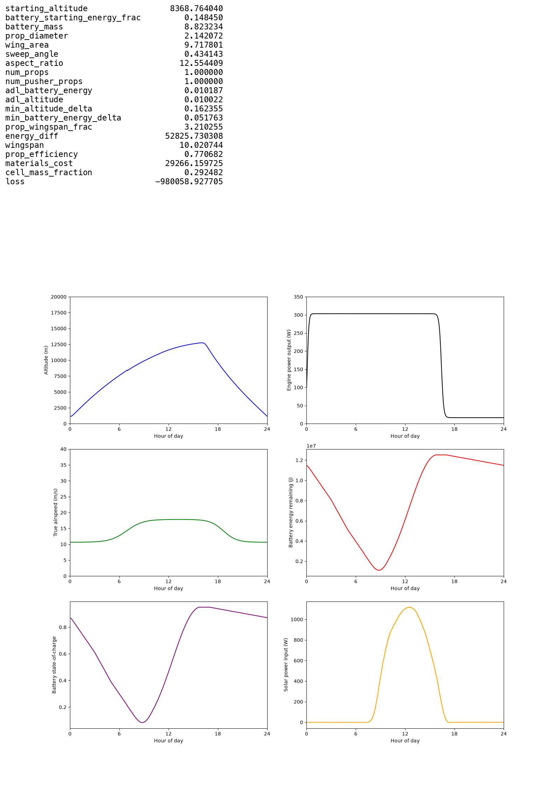

## Atmospheric electric satellite. See [<b>atmosat.ipynb</b>](https://github.com/gusgordon/atmospheric_satellite/blob/master/atmosat.ipynb).

The goal of this project is to explore what a small solar plane would need in order to close a daily energy cycle under simplified assumptions.

The approach is to first make a model of a solar plane that can be fed different parameters such as wingspan, battery mass, cruising altitude, number of props, payload mass, and so on. The model outputs the performance of the solar aircraft.

Different plane configurations are then fed into the model under an optimization procedure (differential evolution seems to work best). The goal of the optimization procedure is to find a plane with low wingspan that can end the simulated day above its starting battery energy and altitude while preserving simple reserve margins.

This is an exploratory solar-endurance aircraft sizing notebook, not a validated atmospheric satellite or HAPS station-keeping design.

The main notebook uses the checked-in irradiance grid. Regenerating that grid requires the optional upstream `airmass` package.

### Results - see [notebook](https://github.com/gusgordon/atmospheric_satellite/blob/master/atmosat.ipynb) for details. All units are in metric (meters, kg, kW, and so on).

